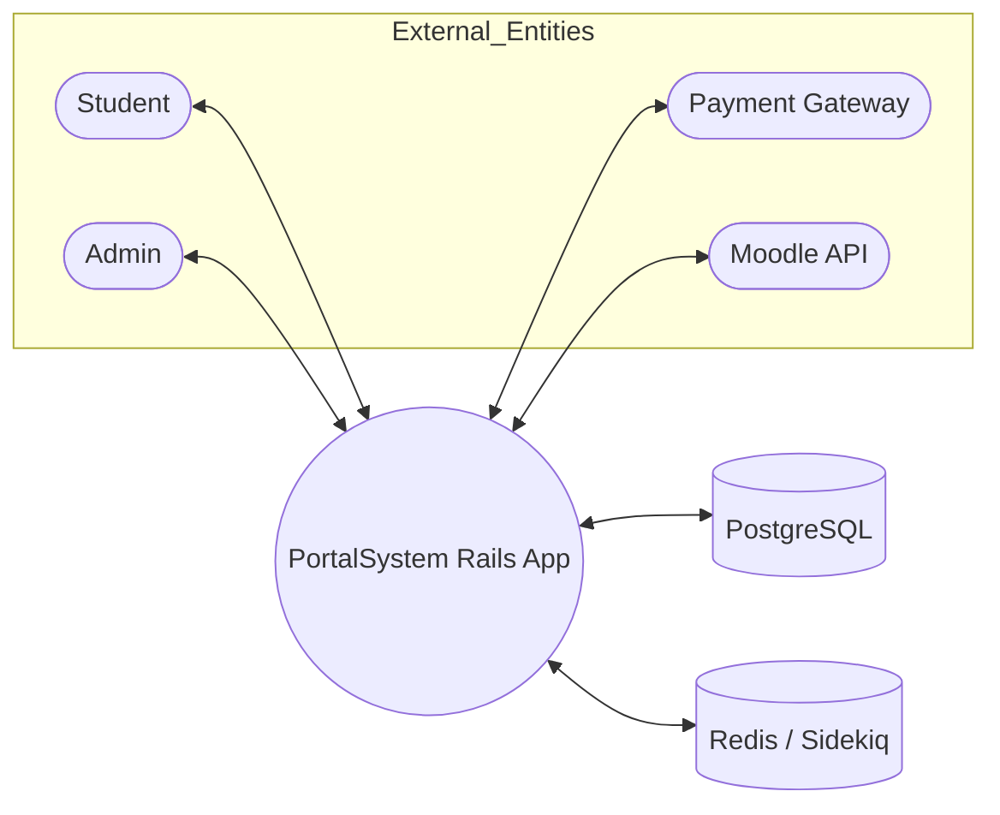
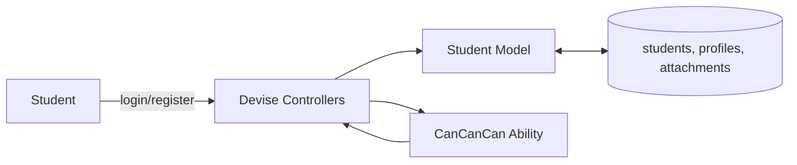
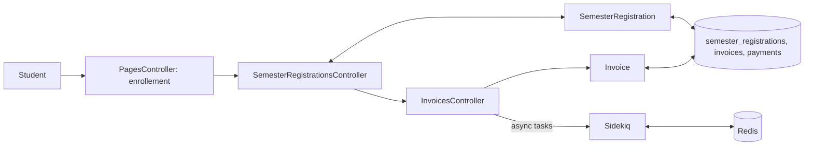
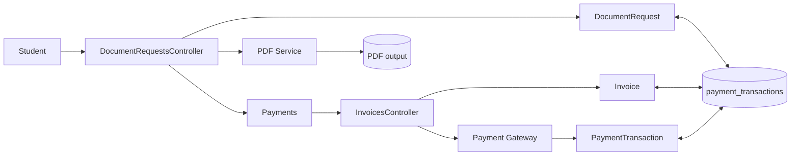
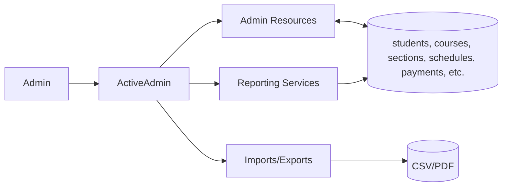

# Data Flow Diagrams

This document presents data flow diagrams (DFD) for the LMS.

Note: These Mermaid diagrams render in compatible viewers (e.g., GitHub, IDE). To include rendered diagrams in the PDF, we can extend the PDF builder to initialize Mermaid during PDF generation.

## Level 0: Context Diagram



## Level 1: Major Processes

```mermaid
flowchart TB
  subgraph UI[Web UI (Controllers/Views)]
    A1[Auth & Profile]
    A2[Semester Registration]
    A3[Courses & Sections]
    A4[Assessments & Grades]
    A5[Documents & Requests]
    A6[Payments & Invoices]
    A7[Schedules & Calendar]
    A8[Admin (ActiveAdmin)]
  end

  subgraph Services[Domain Services]
    S1[PDF Generation (WickedPDF/Prawn)]
    S2[Background Jobs (Sidekiq)]
    S3[Integrations (Moodle)]
    S4[Reporting]
  end

  DB[(PostgreSQL)]
  RS[(Redis)]
  PGW([Payment Gateway])

  A1 --> DB
  A2 --> DB
  A3 --> DB
  A4 --> DB
  A5 --> DB
  A6 --> DB
  A7 --> DB
  A8 --> DB

  A5 --> S1
  A4 --> S1
  S1 --> DB

  A2 --> S2
  A4 --> S2
  A6 --> S2
  S2 <--> RS

  A6 <--> PGW

  A3 --> S3
  S3 <--> DB

  A4 --> S4
  S4 --> DB
```

## Level 2: Authentication & Profile



## Level 2: Semester Registration



## Level 2: Assessments & Grades

```mermaid
flowchart LR
  Instructor[Instructor/Admin] --> AssessCtrl[AssessmensController]
  AssessCtrl --> AssessPlanCtrl[AssessmentPlansController]
  AssessCtrl --> ResultsCtrl[AssessmentResultsController]
  AssessCtrl --> GradesCtrl[GradeReportsController]

  AssessPlanCtrl --> AssessPlan[AssessmentPlan]
  ResultsCtrl --> AssessResult[AssessmentResult]
  AssessCtrl --> Assessment[Assessment]
  GradesCtrl --> StudentGrade[StudentGrade] --> GradeReport[GradeReport]

  AssessPlan <--> DB[(courses, assessments, assessment_plans, assessment_results, student_grades)]
  Assessment <--> DB
  AssessResult <--> DB
  GradeReport <--> DB

  GradesCtrl --> PDF[PDF Service (WickedPDF/Prawn)] --> Files[(PDF output)]
```

## Level 2: Document Requests & Payments



## Level 2: Admin Operations


